# Inventory Management Application

A comprehensive React Native inventory management application built with Expo, featuring item tracking, customer management, and invoice generation with VAT calculations.

## Demo
### Application Demo Video
[Demo Video](https://player.cloudinary.com/embed/?cloud_name=dilyj0hzt&public_id=demo_shxuf4&profile=cld-default
)
### Application Screenshots

<table>
  <tr>
    <td width="30%">
      <h4>Login Screen</h4>
      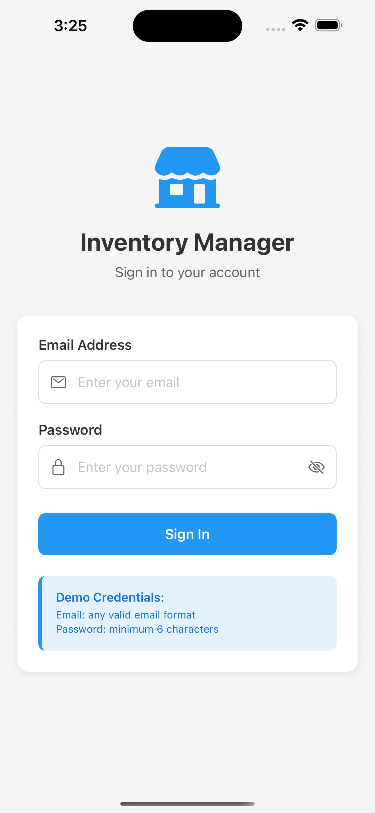
    </td>
    <td width="30%">
      <h4>Dashboard/Homepage</h4>
      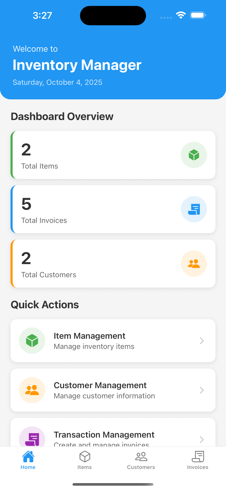
    </td>
    <td width="30%">
      <h4>Item List</h4>
      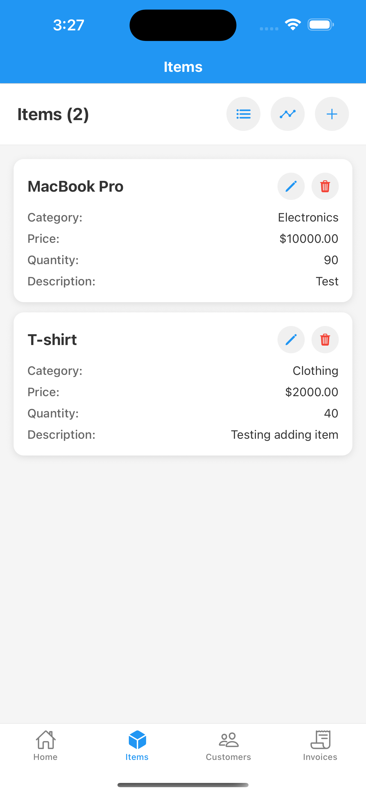
    </td>
  </tr>
  <tr>
    <td width="30%">
      <h4>Customers Screen</h4>
      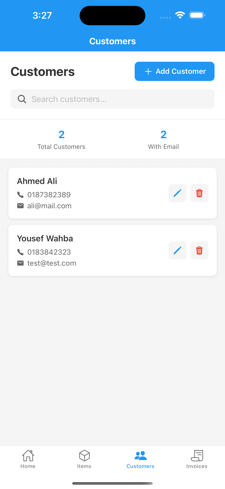
    </td>
    <td width="30%">
      <h4>Inventory Screen</h4>
      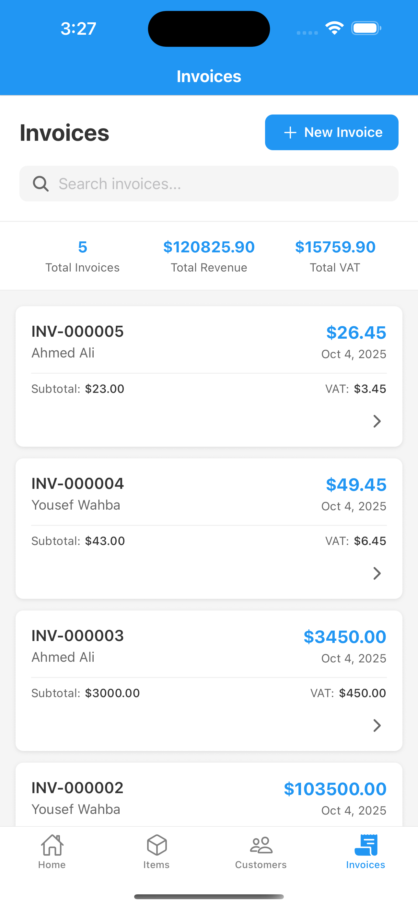
    </td>
    <td width="30%">
      <h4>Item Categories</h4>
      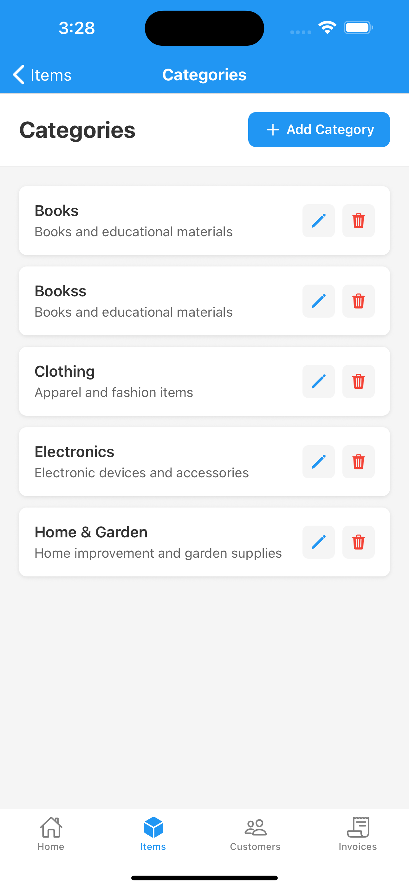
    </td>
  </tr>
  <tr>
    <td width="30%">
      <h4>Create Category</h4>
      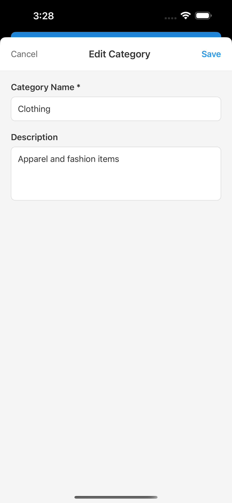
    </td>
    <td width="30%">
      <h4>Add Item</h4>
      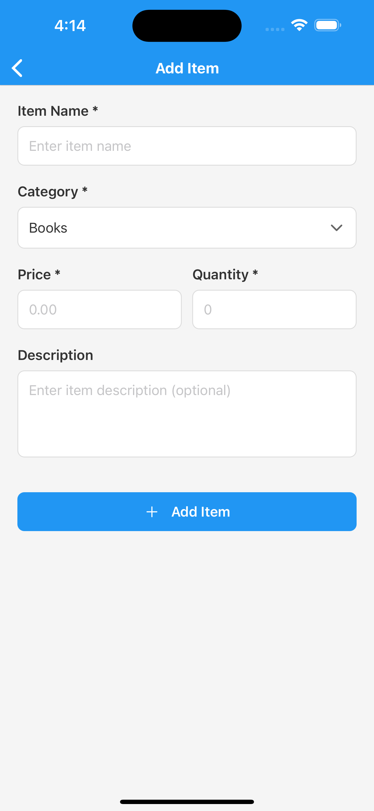
    </td>
    <td width="30%">
      <h4>Update Invoice</h4>
      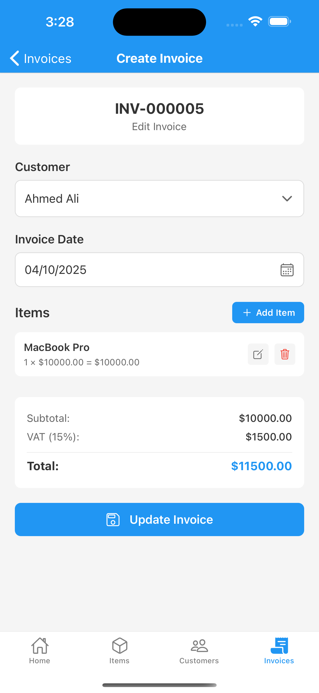
    </td>
  </tr>
  <tr>
    <td width="30%">
      <h4>Add Customer</h4>
      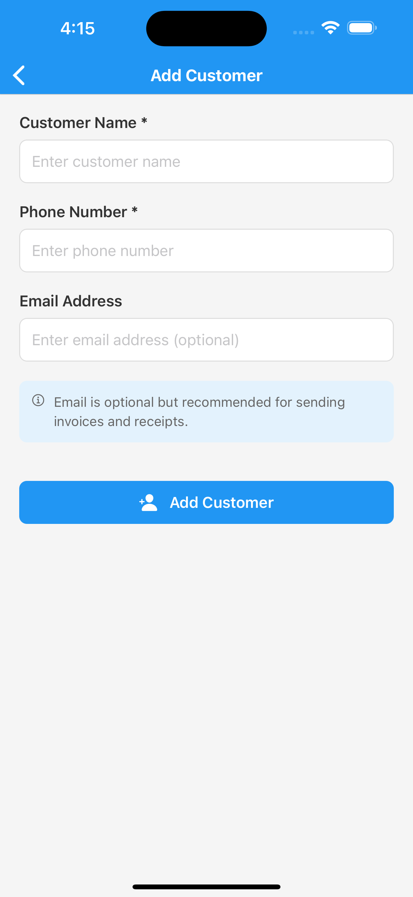
    </td>
    <td width="30%">
      <h4>Create Invoice</h4>
      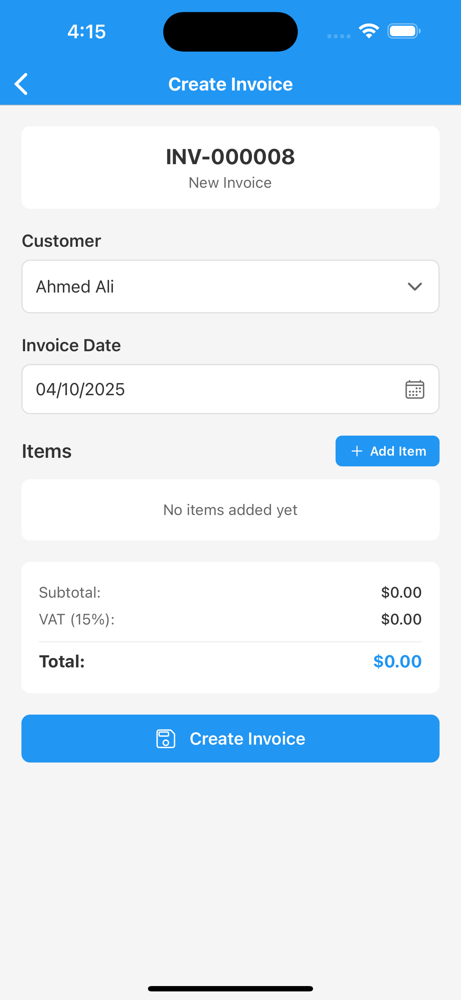
    </td>
    <td width="30%">
      <!-- Empty cell for alignment -->
    </td>
  </tr>
</table>

## Features

### 1. Login Screen
- Email and password fields with validation
- Simple local authentication (no backend required)
- Form validation and error handling

### 2. Homepage/Dashboard
- Dashboard-style layout with navigation menus
- Item Menu access
- Transaction Menu access
- Summary information display:
  - Total number of items
  - Total number of invoices
  - Total number of customers
- Real-time statistics updates

### 3. Item Management Menu
- **Add Item**: Form to add items with name, category, price, and quantity
- **Item List**: Display all items stored in SQLite database
- **Item Category**: Manage categories (add/edit/delete operations)
- **Inventory**: Show stock quantities for all items with low stock alerts

### 4. Customer Management
- Add, edit, and delete customers
- Customer information includes:
  - Name (required)
  - Phone number (required)
  - Email address (optional)
- All customer data saved in SQLite
- Customer linking to invoices

### 5. Transaction Management Menu
- **Sale Invoice List**: Display all saved invoices with search and filter capabilities
- **Create Sale Invoice**: Comprehensive invoice creation form featuring:
  - Customer selection dropdown
  - Date picker for invoice date
  - Auto-generated sequential invoice numbers (INV-000001 format)
  - Category-based item selection
  - Quantity and price entry
  - Extended amount calculation (quantity × price)
  - Automatic total, VAT (15%), and due amount calculations
  - Real-time inventory updates upon invoice creation

## Technical Implementation

### Technology Stack
- **Framework**: React Native with Expo
- **Language**: TypeScript for type safety
- **Navigation**: React Navigation v6 for multi-screen navigation
- **Database**: SQLite with expo-sqlite for local data storage
- **UI Components**: React Native Elements and Vector Icons
- **Form Handling**: Custom validation with React hooks
- **Date Management**: React Native DateTimePicker

### CRUD Operations

The application implements complete CRUD (Create, Read, Update, Delete) operations for:
- **Items**: Full inventory management with category associations
- **Categories**: Dynamic category management system
- **Customers**: Complete customer database management
- **Invoices**: Comprehensive invoice creation and management

### Invoice Calculations

The system automatically handles:
- **Extended Amount**: Quantity × Unit Price
- **Subtotal**: Sum of all extended amounts
- **VAT Calculation**: 15% of subtotal
- **Total Amount**: Subtotal + VAT
- **Inventory Updates**: Automatic stock reduction upon invoice creation

## Installation and Setup

### Prerequisites
- Node.js (v16 or higher)
- npm or yarn package manager
- Expo CLI (`npm install -g @expo/cli`)
- Expo Go app on mobile device for testing

### Installation Steps

1. **Clone the repository**
   ```bash
   git clone <repository-url>
   cd inventory-app
   ```

2. **Install dependencies**
   ```bash
   npm install
   ```

3. **Start the development server**
   ```bash
   npx expo start
   ```

4. **Run on device/simulator**
   - Scan QR code with Expo Go app (Android/iOS)
   - Press `i` for iOS simulator
   - Press `a` for Android emulator
   - Press `w` for web browser

## Quick Start - Run on Your Device

To quickly run this app on your mobile device:

1. **Install Expo Go app on your device**
   - Download from [App Store (iOS)](https://apps.apple.com/app/expo-go/id982107779) or [Google Play Store (Android)](https://play.google.com/store/apps/details?id=host.exp.exponent)

2. **Download the repository**
   ```bash
   cd inventory-app
   ```
3. **Install dependencies**
   ```bash
   npm install
   ```

4. **Start the development server**
   ```bash
   npx expo start
   ```

5. **Scan QR code with your device**
   - Open Expo Go app on your device
   - Scan the QR code displayed in your terminal or browser
   - The app will load automatically on your device

## Project Structure

```
src/
├── components/
│   ├── AnimatedButton.tsx       # Reusable animated button component
│   ├── CategoryDropdown.tsx     # Category selection dropdown
│   ├── ConfirmDialog.tsx        # Confirmation dialog component
│   ├── CustomerDropdown.tsx     # Customer selection dropdown
│   └── ToastContext.tsx         # Toast notification system
├── database/
│   └── database.ts              # SQLite database service and operations
├── navigation/
│   └── AppNavigator.tsx         # Navigation configuration and routing
└── screens/
    ├── HomeScreen.tsx           # Dashboard with statistics
    ├── LoginScreen.tsx          # Authentication screen
    ├── customers/
    │   ├── CustomerListScreen.tsx
    │   └── AddCustomerScreen.tsx
    ├── invoices/
    │   ├── InvoiceListScreen.tsx
    │   └── CreateInvoiceScreen.tsx
    └── items/
        ├── ItemListScreen.tsx
        ├── AddItemScreen.tsx
        ├── CategoryListScreen.tsx
        └── InventoryScreen.tsx
```


## UI/UX Design

The application follows a professional, business-oriented design approach:
- Clean and minimal interface
- Consistent color scheme and typography
- Intuitive navigation patterns
- Form validation with clear error messages
- Loading states and user feedback
- Responsive design for various screen sizes

## Building for Production

### Android Build
```bash
npx expo build:android
```

### iOS Build
```bash
npx expo build:ios
```

### Web Export
```bash
npx expo export:web
```

## Development Guidelines

### Code Quality Standards
- TypeScript strict mode enabled
- Consistent code formatting and linting
- Component-based architecture
- Proper error handling and validation
- Database transaction management

### Testing Considerations
- Form validation testing
- Database operation testing
- Navigation flow testing
- Invoice calculation accuracy testing

### Performance Optimization
- Database query optimization
- Image loading optimization
- Component memoization where appropriate
- Efficient list rendering for large datasets
